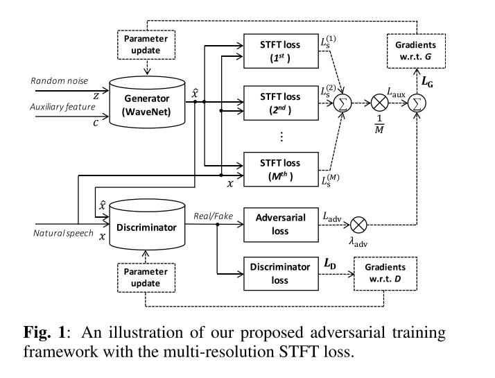
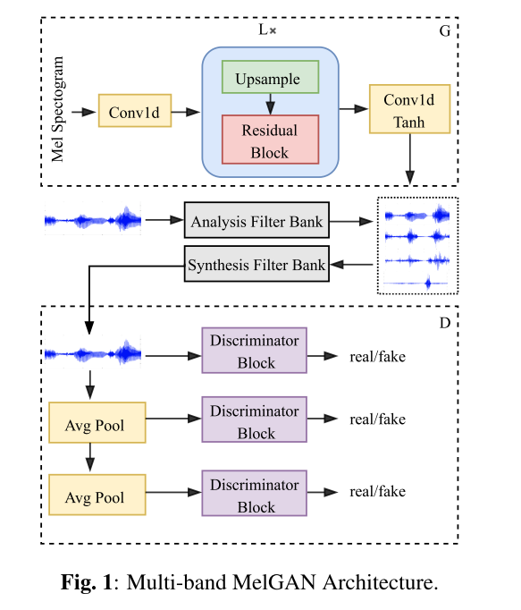
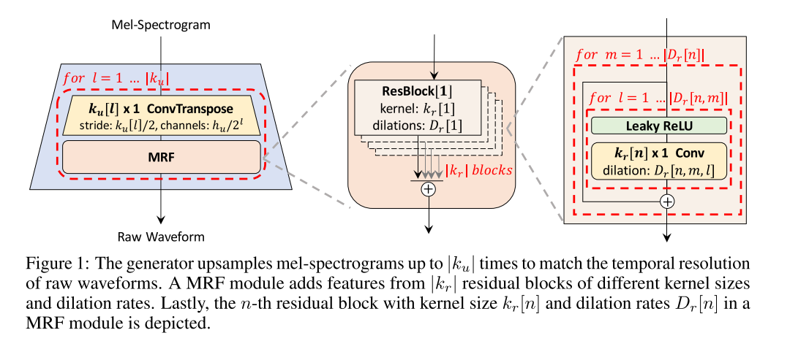
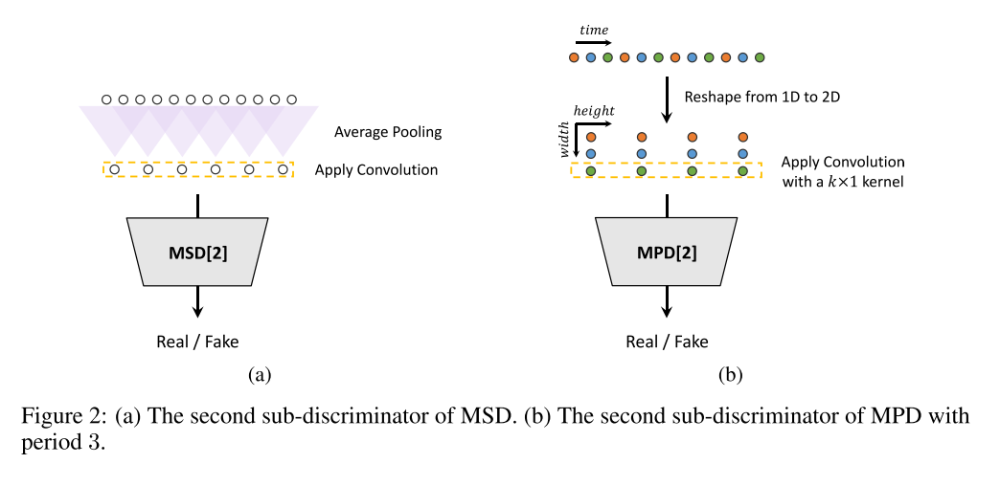
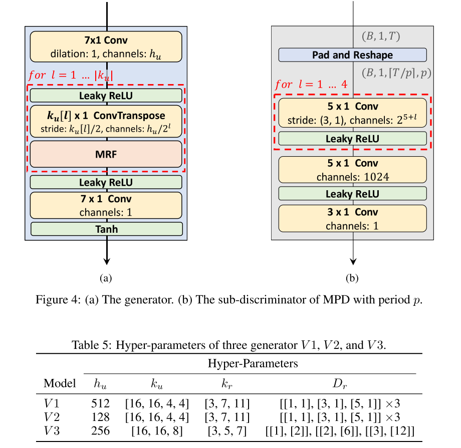

# GAN Based Vocoder

**声码器**的总结如下:

| **模型类型** | **模型**          | **合成语音质量** | **效率**   |
| ------------ | ----------------- | ---------------- | ---------- |
| AR           | WaveNet           | 非常好           | 非常差     |
| AR           | WaveRNN           | 非常好           | 中等       |
| AR           | Multiband WaveRNN | 非常好           | 中等       |
| AR           | LPCNET            | 非常好           | 挺好的     |
| Non-AR       | Parallel WaveNet  | 非常好           | 还不错     |
| Non-AR       | WaveGlow          | 非常好           | 还不错     |
| Non-AR       | FlowWaveNet       | 非常好           | 还不错     |
| GAN          | ParallelWaveGAN   | 非常好           | 挺好的     |
| GAN          | MelGAN            | 挺好的           | 非常好     |
| GAN          | MB-MelGAN         | 非常好           | 非常非常好 |

从上面表格中可以看到基于神经网络的声码器效果都挺好的，主要需要优化的就是生成的速度。出现了利用GAN的声码器之后，推理速度也极大的提高了。

There were several early attempts applying GANs to audio genera- tion tasks, but achieved limited success [6]. Recently, there has been a new wave of modeling audio using GANs, as non- AR models targeting to fast audio generation. Specifically, MelGAN [20], Parallel WaveGAN [21] and GAN-TTS [22] have shown promising performance on waveform generation tasks. They all rely on an adversarial game of two networks: a generator, which attempts to produce samples that mimic the reference distribution, and the discriminator, which tries to differentiate between real and generated samples. The in- put of MelGAN and Parallel WaveGAN is mel-spectrogram, while the input of GAN-TTS is linguistic features. Hence MelGAN and Parallel WaveGAN are considered as neural vocoders, while GAN-TTS is a stand-alone acoustic model. Meanwhile, Parallel WaveGAN and MelGAN both use auxil- iary loss, i.e., multi-resolution STFT loss and feature match- ing loss, respectively, so they converge significantly faster than GAN-TTS. Impressively, the pytorch implementation of MelGAN runs at more than 100x faster than real-time on GPU and more than 2x faster than real-time on CPU. On the contrast, the real-time factor of Parallel WaveGAN is limited because of the stacking of network layers. According to the provided demos, the speech synthesized by MelGAN and Parallel WaveGAN is not satisfactory with audible artifacts.

## GAN Vocoder

1. Parallel WaveGan

   

   In the proposed method, only a non-autoregressive WaveNet model is trained by optimizing the combi- nation of multi-resolution short-time Fourier transform (STFT) and adversarial loss functions that enable the model to effectively capture the time-frequency distribution of the realistic speech wave- form. 

   In the STFT-based time-frequency representation of signals, there is a trade-off between time and frequency resolution; e.g., increasing window size gives higher frequency resolution while reducing temporal resolution.

2. MelGAN

   

3. MB-MelGAN

   Specifically, we improve the original MelGAN by the following aspects. First, we increase the receptive field of the generator, which is proven to be beneficial to speech genera- tion. Second, we substitute the feature matching loss with the multi-resolution STFT loss to better measure the difference between fake and real speech.

   More importantly, we extend MelGAN with multi- band processing: the generator takes mel-spectrograms as in- put and produces sub-band signals which are subsequently summed back to full-band signals as discriminator input. 

   

4. HiFi-GAN

   As speech audio consists of sinusoidal signals with various periods, we demonstrate that modeling periodic patterns of an audio is crucial for enhancing sample quality.

   We propose HiFi-GAN, which achieves both higher computational efficiency and sample quality than AR or flow-based models. As speech audio consists of sinusoidal signals with various periods, modeling the periodic patterns matters to generate realistic speech audio. Therefore, we propose a discriminator which consists of small sub-discriminators, each of which obtains only a specific periodic parts of raw waveforms. This architecture is the very ground of our model successfully synthesizing realistic speech audio. As we extract different parts of audio for the discriminator, we also design a module that places multiple residual blocks each of which observes patterns of various lengths in parallel, and apply it to the generator.

   HiFi-GAN consists of one generator and two discriminators: multi-scale and multi-period discrimina- tors. 

   

   

   Note that MPD operates on disjoint samples of raw waveforms, whereas MSD operates on smoothed waveforms.

   

## Repos

* https://github.com/kan-bayashi/ParallelWaveGAN
* https://github.com/jik876/hifi-gan

## Reference

* **PARALLEL WAVEGAN**: A FAST WAVEFORM GENERATION MODEL BASED ON GENERATIVE ADVERSARIAL NETWORKS WITH MULTI-RESOLUTION SPECTROGRAM
* **MelGAN***: Generative Adversarial Networks for Conditional Waveform Synthesis
* **MULTI-BAND MELGAN**: FASTERWAVEFORM GENERATION FOR HIGH-QUALITY TEXT-TO-SPEECH
* **HiFi-GAN**: Generative Adversarial Networks for Efficient and High Fidelity Speech Synthesis

